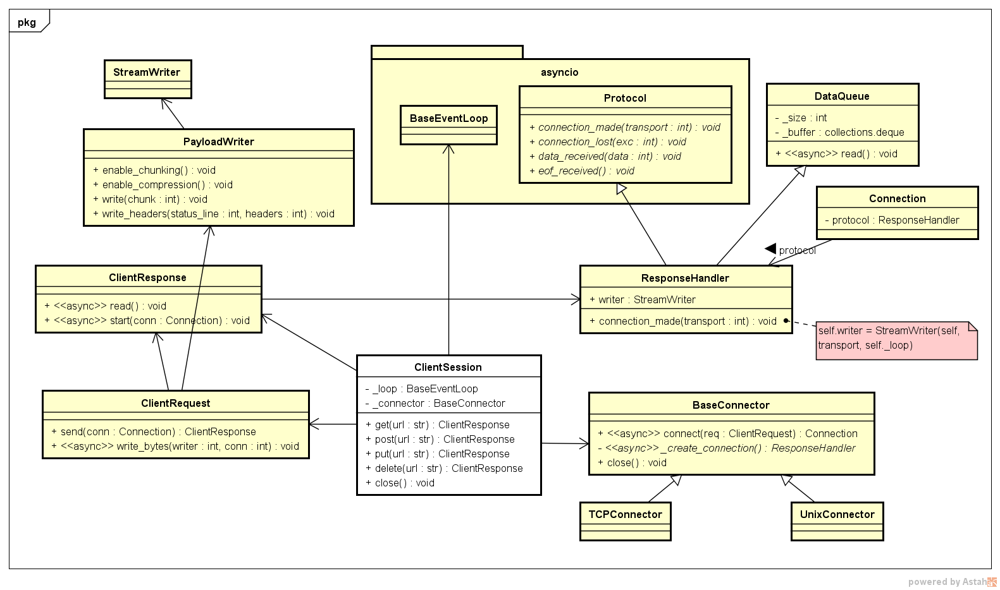
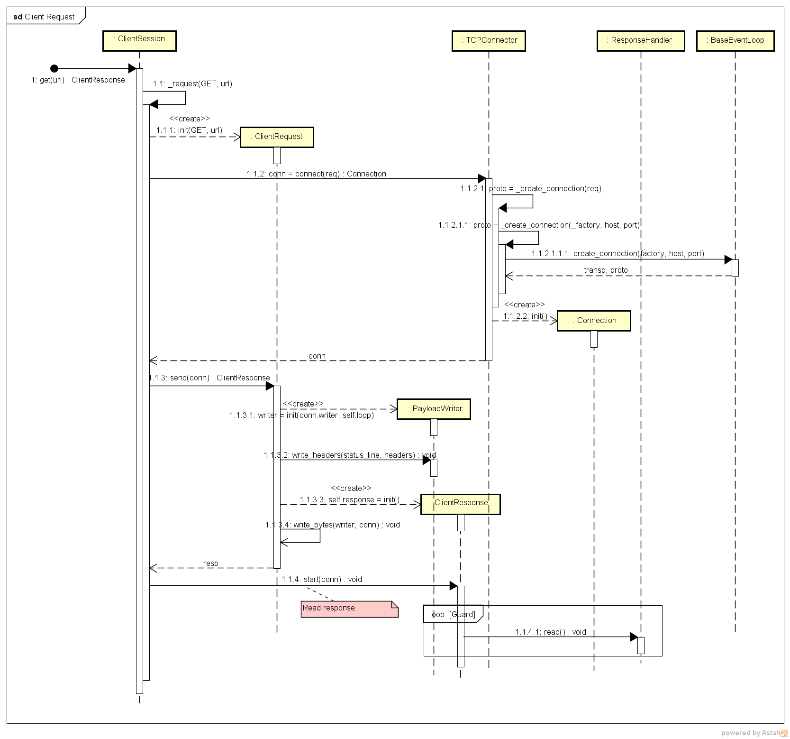

# Python 的异步 IO：Aiohttp Client 代码分析

[Aiohttp](https://github.com/aio-libs/aiohttp) 是 Python 的一个 HTTP 框架，基于 asyncio，所以叫 Aiohttp。

我主要是看源码，想理解它的设计，所以附上了类图与时序图。不可避免的，可读性会比较差。
想找教程的话，请移步 [官方教程](https://docs.aiohttp.org/en/stable/)，写得还是挺不错的。

## 一个例子

下面这个例子，通过 HTTP GET 列出 GitHub 的 [public events](https://developer.github.com/v3/activity/events/#list-public-events)：
```python
import asyncio
import aiohttp

async def main():
    async with aiohttp.ClientSession() as session:
        async with session.get('https://api.github.com/events') as resp:
            print(resp.status)
            print(await resp.text())

loop = asyncio.get_event_loop()
loop.run_until_complete(main())
```
Response 是一个 JSON 格式的文本：
```json
[
  {
    "id": "6888907432",
    "type": "PushEvent",
    "actor": {
      "id": 3956266,
      "login": "sekineh",
      "display_login": "sekineh",
      "gravatar_id": "",
      "url": "https://api.github.com/users/sekineh",
      "avatar_url": "https://avatars.githubusercontent.com/u/3956266?"
    },
    // ...
```
 
`ClientSession` 是一个 [Asynchronous Context Manager](https://docs.python.org/3/reference/compound_stmts.html#async-with)，所以搭配 `async with` 语句一起使用。像下面这样应该也是可以的：
```python
async def main():
    session = aiohttp.ClientSession()
    ...
    await session.close()
```
不过肯定是不推荐的，就当是帮助理解吧。

`ClientSession.get()` 返回一个 `ClientResponse` 对象，通过 `text()` 方法，可以拿到  response 的文本：
```python
print(await resp.text())
```
当然，`text()` 是一个协程：
```python
    @asyncio.coroutine
    def text(self, encoding=None, errors='strict'):
        """Read response payload and decode."""
        ...
```

## Connector

`ClientSession`  依赖 Connector 来创建连接，缺省为 `TCPConnector`，它继承自 `BaseConnector`，此外还有 `UnixConnector`（应该是 Unix Domain Socket）。

Connector 的接口比较简单，主要提供了 `connect()` 方法（也是协程）：
```python
    @asyncio.coroutine
    def connect(self, req):
        """Get from pool or create new connection."""
        ...
```
以及 `close()` 方法：
```python
    def close(self):
        """Close all opened transports."""
        ...
```

## ConnectionKey

`ClientRequest` 有个属性 `connection_key`：
```python
class ClientRequest:
    @property
    def connection_key(self):
        return ConnectionKey(self.host, self.port, self.ssl)
```
它是一个 `namedtuple`：
```python
ConnectionKey = namedtuple('ConnectionKey', ['host', 'port', 'ssl'])
```
由 `host`，`port` 和 `ssl` 三个元素组成，这三个元素可以唯一定义一个连接，所以叫 `ConnectionKey`。
文章开头的那个例子中，ConnectionKey 为：
```python
ConnectionKey(host='api.github.com', port=443, ssl=True)
```

## 全局函数 request()

Aiohttp 为 Client 程序提供了一个全局函数 `request()`，用法如下：
```python
async def main():
    resp = await aiohttp.request('GET', 'http://python.org/')
    print(resp)
    
loop = asyncio.get_event_loop()
loop.run_until_complete(main())
```
可见 `request()` 只是 `ClientSession` 的一个简单封装，其步骤大致为：

- 创建 `TCPConnector`；
- 创建 `ClientSession`；
- 调用 `ClientSession._request()`。

建议不要直接使用 `request()`，而只把它当成 `ClientSession` 的一个样例。因为 Aiohttp 官方文档是 [这样说的](https://docs.aiohttp.org/en/stable/client.html)：

> Don’t create a session per request. Most likely you need a session per application which performs all requests altogether.
> A session contains a connection pool inside, connection reusage and keep-alives (both are on by default) may speed up total performance.

即，一个 request 用一个 session，太浪费；通常是一个 application 用一个 session。

## 一些小问题

我经常发现一个变量，明明可以是局部变量，却被当成了成员变量。

Request 里放了一个 response？
```python
class ClientRequest:
    def send(self, conn):
	    ...
        self.response = self.response_class(
            self.method, self.original_url,
            writer=self._writer, ...
        )

        self.response._post_init(self.loop, self._session)
        return self.response
```
`self.response` 在 `ClientRequest` 其他地方并没有用到，是否可以改成局部变量？

`ClientResponse.start()` 里的 `_protocol` 应该用局部变量吧？
```python
class ClientResponse:
   @asyncio.coroutine
    def start(self, connection, read_until_eof=False):
        """Start response processing."""
        self._closed = False
        self._protocol = connection.protocol
```

## 类图




## 时序图




**The End**
